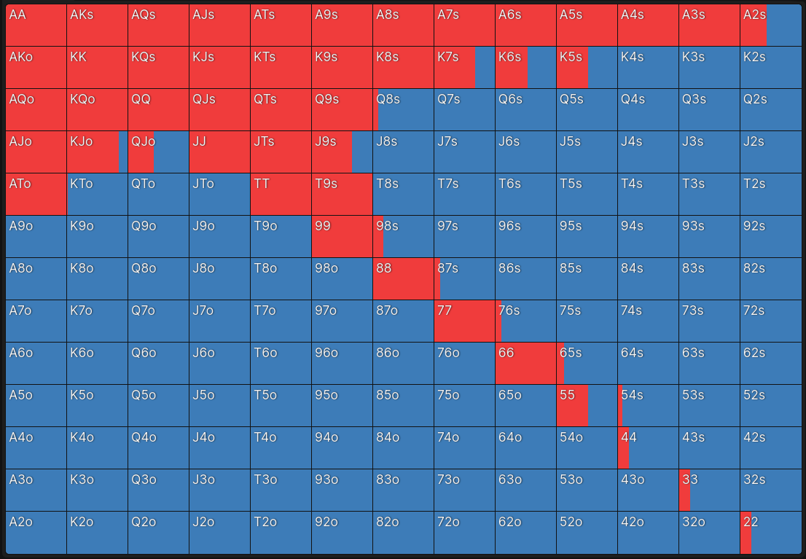
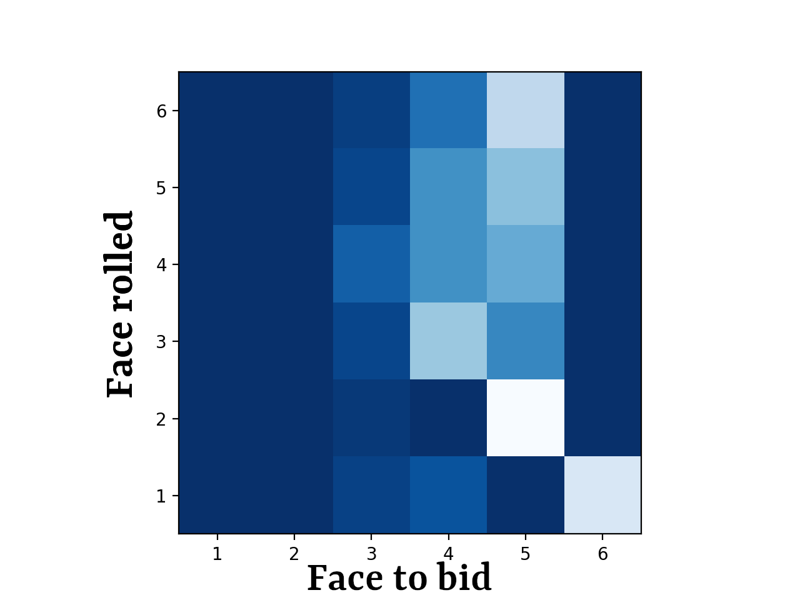
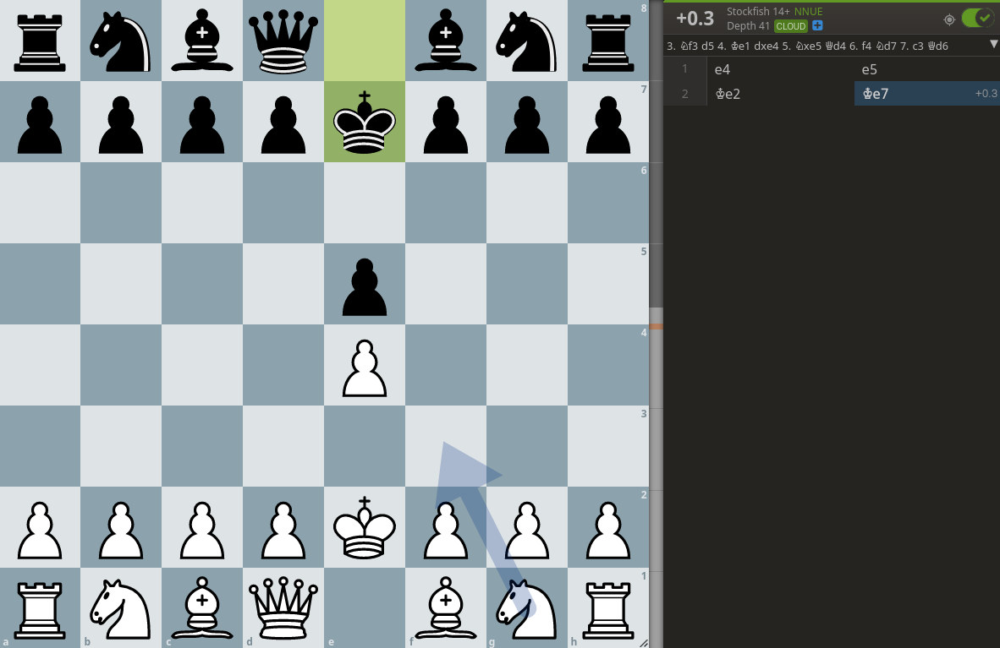

People have vices. One of those is gambling. Whether it's a poker night, a super bowl bet, or picking investments, everyone gambles. This isn't anything new either, people have been gambling for thousands of years [1]. In recent years, as compute power has gotten more accessible, incredible bodies of analysis have been produced to better understand the games we wager on (or just play for fun). Given how much we like to gamble, this is hardly surprising- and we're not even considering the quantity of money involved. Poker, fantasy football, and the stock market are all great examples of games that are saturated with near-infinite technical analysis available. While I'd love to contribute something to any of these fields, there are people with more time, money, and smarts than me doing the heavy lifting here. If I can't do that, what might be possible is using existing knowledge of popular games to guide discoveries about games outside the spotlight.

I'll be diving into that today, with my out-the-spotlight game being Liars Dice. My target is to gain a practical advantage while I'm playing. Liars dice is a game I play with my friends: I don't need a series of equations to model liars dice. I need strategies to win games, or at least to help. I'm not a mathematician, nor an expert poker player. But in order to gain some small advantages, I'm not sure I need to be. This writing documents what I learned (and what I couldn't), for a game that's a bit less discovered than Go or Chess. 

# Rules of the Game

You can play with any number of players, but I'm going to keep my focus to a heads-up game of liars dice with 2 total players. Each player starts with 6 dice, and lose dice as the game goes on. Each round begins with all players rolling their dice in secret (usually covered by a cup). The players alternate making "bids" about the total dice pool that has been rolled. For example, I would begin the round by bidding "two 2's", claiming that I believe there to be at least two 2's in the 12 total dice rolled (My 6 which I can see, plus my opponent's 6, which are hidden). 

My hypothetical opponent, can either increment the face count up (eg. two 3's, or two 5's), or increment the dice count (three 2's), or both (four 6's). If the dice count gets incremented, the face count can be lowered- 3 six's -> 4 one's, but not vice versa. This leads to a dynamic where the bid's are growing higher and higher, until they start to get unreasonable. 

At any point, a player may call "bullshit" on the bid his opponent just made. When this happens, all player reveal their dice, counting up all dice that match the bid, and the player who was incorrect must discard a die. Each die that is lost is information lost for previous rounds, which makes mounting comebacks quite difficult.  

The last rule is that 1's count as jokers, representing all faces. When tallying up all the 4's, you really count all the 4's and all the 1's. The same goes for 2, or 3, or any face. This is the version I've seen most commonly, but there are other versions that don't include this rule.  

# Strategy

The simple gameplay of liars dice invites complex strategy, due to rapidly changing information dynamics. In game theory, Liars Dice would be labeled an asymmetric game. Similar to poker, opponents have differing amounts, and quality, of information at any given time. Unlike a game like chess, where all game state is visible to all players, the decisions made in Liars Dice require making guesses about hidden information.

As you might have been able to pick up from the name, Liars Dice requires some amount of bluffing. If you only bid representing the dice in your hand, you'll be able to rope in rounds when your opponent inevitably calls you- but after multiple hands against a diligent opponent they will take note, and become more and more unlikely to call you. On the flip side, if you only ever lie about the dice you hold, you will quickly start to get called often. This isn't just a broad strategy note, it applies to individual hands as well. If you always bluff 6's with low rolls, you gifting your opponent an unnecessary edge that they could notice and exploit. 

All of these strategy I've listed would be considered a "Pure Strategy", and in a game like liars dice, are open to exploitation.

This compares well to other asymmetric information games, such as poker, where your actions need to disguise the information that you used to make those decisions. Compared this to chess, where the information is perfect for both players: the concept of a "bluff" doesn't really make much sense.

If Liars dice really compares so well to other asymmetric information games, could we start with one of those?

# GTO

The holy grail of Texas Hold'em play is a mathematically derived strategy dubbed "Game Theory Optimal", or GTO. "GTO Poker" describes a theoretical strategy that when played perfectly, is mathematically unexploitable- Over infinite hands, you could never lose money, no matter how adaptable your opponent is to your strategy.  In practice, GTO play can be thought of as playing though a function: Input the table state, output a list of actions, some of which are likely than others. 

Generalizing GTO into a more general game philosophy: In order to play defensively against your opponent, multiple actions must be considered. The "best" decision cannot get chosen every time, it must be balanced by some frequency of suboptimal plays. Exclusively playing the "best" surrenders your information advantage, which is the most important dynamic in asymmetric games.

This is dubbed a "Mixed Strategy" in game theory. A mixed strategy dictates probabilities to act on a range of actions, for any given state. Compared to a Pure Strategy, where with a given input a player will always have a discrete output, a mixed strategy often won't guarantee a specific output for any given input.  

In Texas Hold'em, one of the simpler parts of GTO is pre-flop strategy. Pre-flop represents your first action after looking at your 2 hole cards. A good pre-flop player can boil the table state into 3 variables: Cards, Position, and incoming action, and act accordingly. For example, being 1st to act (Also called Under The Gun), with a suited K8, we'd raise 87.5% of the time, and fold the other 12.5% of the time. If we we're sitting in cutoff, which acts later, we would raise that hand 100% of the time! In fact, even if we got dealt K3 suited (A noticeably worse hand), we would still raise 100% of the time in that position! 

Model this function across every possible hand you could be dealt, and you end up with a GTO pre flop strategy. Visualized, it looks something like this: 

| |
|:--:|
| *Red represents raise. Blue represents fold. [[4]](https://app.gtowizard.com/)* |

Now, the question is: If you can't lose money playing GTO, why doesn't everyone play GTO? Well, going back to the "Theoretical" designation I gave GTO, it's humanly impossible to play perfect GTO poker. Playing perfect GTO is no different than always knowing the best chess move. Easier said than done. While always sticking to GTO is impossible, we can still aim to adapt GTO strategy into our play, making us slightly more unexploitable than our opponent. 

If we can model this in a game like Poker, could we do something similar in Liars Dice?

# Nash Equilibrium

Here, I'm going to ask you, the reader, to humor me with a hypothetical.

Imagine two robots, Tim and Bob, sat at a table with chips and a deck of card. They're both infinitely smart, and are thus perfect poker players, able to execute GTO to a T. Being infinitely smart, Tim knows Bob plays GTO. He knows that GTO is defensive, and is mathematically unexploitable if played correctly. Tim knows Bob will play it correctly, so the best he can do it be unexploitable himself. Bob knows that he's unexploitable, but he also knows Bob will play the same. Lets say we throw them the bone of infinite time, and where do we end up? Nowhere. They both play perfectly, and over infinite hands, neither wins a dime, unable to adapt their perfect strategy against their opponents mirror strategy. 

In broader Game Theory terms, this is called a Nash Equilibrium. Nash Equilibrium's occur in games when opponents know each other's strategies, and still have nothing to gain from changing their own strategy. Boiling it down, even assuming your opponent completely understands your strategy, there exists no strategy to take advantage of you; Leaving them with... The exact same strategy. I'd like to again emphasize that this is theory in a vacuum. At the casino, nobody plays perfect GTO. In fact, most players don't even get close, and aren't really trying to.  We gain our advantage by aiming to be unexploitable, while exploiting our opponents. While conceptual poker can be solved to an equilibrium, an actual game of poker is very far from it.

Understanding these concepts can lead to advantages in poker, but what about Liars Dice? More specifically, does Liars Dice even have a Nash Equilibrium? 

# Back to Liars Dice.

It does. John Nash proved that for any finite game, there exists at least one Nash Equilibrium. This was published in his 1950's paper "Non-Cooperative Games", and unsurprisingly, is why the equilibrium is named after him. So, how do we find it? 

Now, here's where I lucked out: someone had already calculated the Nash Equilibrium for Liars Dice! Thomas Ahle has an amazing [project](https://github.com/thomasahle/snyd) [3] where he calculates pieces of the Equilibrium strategy for Liars Dice, using a super clever way to break the game down. While a traditional game of liars dice consists of two players playing multiple rounds until a player loses all of their dice, we can slice the game into "minigames". Instead of thinking of "Liars Dice" as one game, we can think of it as a set of individual games, where the outcome of the previous dictates the next minigame. The first round can be defined as a 6-Dice vs 6-Dice game, the next a 6v5, and the next either a 6v4, or a 5v5 depending on the winner of the previous. This slicing of the game state isolate's out the dice count variable, putting the focus on bidding strategies (right where we want it). Each minigame will have it's own Nash Equilibrium, with the overall Nash Equilibrium being the set of respective minigame Equilibriums.

Starting from the end, we can see the Equilibrium Table for opening a 1 die vs 1 die game: 
| |
|:--:|
| *Lighter areas represent positive probability to bid said face. Table generated by Thomas Able [[5]](https://github.com/thomasahle/snyd). * |

With a quick glance, we can get a few takeaways for 1v1 play.  
- Rolling a 1 looks to be a strong position.
- Rolling a 1, or a 2, and your play is somewhat straightforward. 3-6 is more variable.
- Never open up with a 6 unless you have a joker 1.

However, without a way to trace a line of play deeper than a single move, it makes it pretty difficult for us to guarantee a lasting advantage. However, not letting perfect be the enemy of good, I'll take what I can get.

But what about the rest of the minigames? 3v1? 5v2? 6v3? As the dice count grow, the computational complexity needed to calculate the equilibrium grows exponentially. We quickly reach the upper limit of what is amateurly calculatable, and need to move into methods that approximate the best plays, not guarantee them. What this interface like in practice is likely something similar to [Lichess's analysis engine](https://lichess.org/analysis). 

This is built on top of Stockfish, an incredibly powerful analysis engine for chess, which we don't have available for Liar's Dice. However, in Thomas' article, he goes down this path, training a Neural Net for each of minigames, the combination of which creates an engine. You can play against it [here](https://dudo.ai/).

# Throwing a wrench in it
Okay, there was one small piece I left out. The version of Liar's Dice I play, has a special rule about the jokers (1's). If a player's opening bid is 1 (eg. One 1, Three 1's), the 1's no longer act as a joker for the rest of the round. In deeper stacked rounds, such as 5v6, this has a negligible effect on the gameplay. However, this option completely throws our previous 1v1 equilibrium table in the trash! If not having a joker puts you at a disadvantage to your opponents possible joker, bidding [One 1] seems like a very good move- Nullifying your opponent's joker. But this only makes sense if you don't have a joker, which your opponent is sure to figure out, and call you on eventually- Argh. Now we need to shoot ourselves in the foot sometimes and call One-1 when we roll a Joker? Damn mixed strategies... If only we had an engine that could figure this change out.

# Wrapping it up
I got sucked into researching this stuff. I've done my fair share of poker study, and statistics based modeling, but Nash Equilibriums are new to me. I found the theoretical game theory definitions as extremely fascinating, but left me wondering: will any of this actually end up helping me out in my next game? I'm not so sure. I certainly gained a bit of understanding about the 1v1 endgames, but likely just enough to give me a small advantage. Without having an analysis engine to implement the theory, it's pretty difficult to translate it into actual plays. 

However, I'm sure that anyone who is thinking about Nash Equilibriums or Game Theory is already pretty good at Liars Dice- or that's at least what I'd like to tell myself.

# Whats next?
Going back to my main objective of practical gameplay knowledge, I need to get more in the weeds. Train a Liars Dice model, or build an explorer using an existing one. Unfortunately, this technical work would have definitely eclipsed the amount of effort I wanted to put this article. I've been trying to force myself to ship, and realistically chunking how much effort a project takes is a big part of that. Considering this blog as an quick introduction, with some more technical work hopefully to come. Thanks for reading this far, and more is on it's way.

[1] https://en.wikipedia.org/wiki/Gambling#History  
[2] https://nashpy.readthedocs.io/en/stable/  
[3] nash equilibirum liars dice post TBD  
[4] https://app.gtowizard.com/  
[5] https://github.com/thomasahle/snyd  
